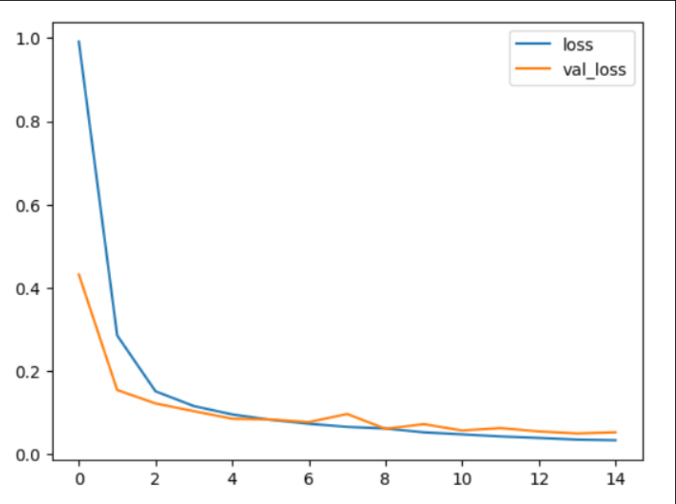
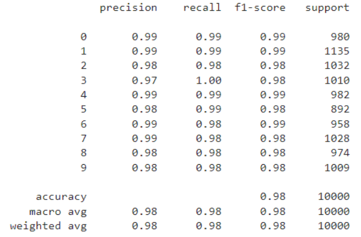
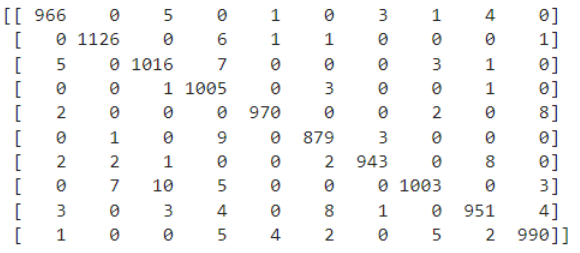
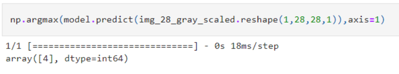
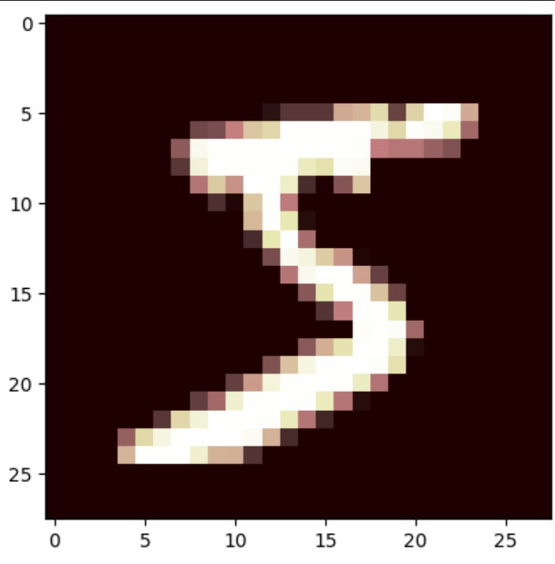

# Convolutional Deep Neural Network for Digit Classification

## AIM

To Develop a convolutional deep neural network for digit classification and to verify the response for scanned handwritten images.

## Problem Statement and Dataset
Digit classification and to verify the response for scanned handwritten images.

The MNIST dataset is a collection of handwritten digits. The task is to classify a given image of a handwritten digit into one of 10 classes representing integer values from 0 to 9, inclusively. The dataset has a collection of 60,000 handwrittend digits of size 28 X 28. Here we build a convolutional neural network model that is able to classify to it's appropriate numerical value.


## Neural Network Model

Include the neural network model diagram.

## DESIGN STEPS

### STEP 1:

import tensorflow and preprocessing libraries
### STEP 2:
Build a CNN model

### STEP 3:

Compile and fit the model and then predict
## PROGRAM
``
## DEVELOPED BY:- EZHIL  MAHTI.R
## REG NO:- 212221230026
```py
import tensorflow as tf
from tensorflow.keras.models import Sequential
from tensorflow.keras.layers import Conv2D
from tensorflow.keras.layers import MaxPool2D
from tensorflow.keras.layers import Dense
from tensorflow.keras import layers
from tensorflow.keras.datasets import mnist
import matplotlib.pyplot as plt
from tensorflow.keras import utils
import pandas as pd
import numpy as np
from sklearn.metrics import classification_report,confusion_matrix
from tensorflow.keras.preprocessing import image
(x_train,y_train),(x_test,y_test)=mnist.load_data()
plt.imshow(x_train[0],cmap='gray')
x_train_scaled=x_train/255
x_test_scaled=x_test/255
print(x_train_scaled.min())
x_train_scaled.max()
y_train_onehot = utils.to_categorical(y_train,10)
y_test_onehot = utils.to_categorical(y_test,10)
x_train_scaled = x_train_scaled.reshape(-1,28,28,1)
x_test_scaled = x_test_scaled.reshape(-1,28,28,1)
model=Sequential([layers.Input(shape=(28,28,1)),
                  Conv2D(filters=32,kernel_size=(5,5),strides=(1,1),padding='valid',activation='relu'),
                  MaxPool2D(pool_size=(2,2)),
                  Conv2D(filters=64,kernel_size=(5,5),strides=(1,1),padding='same',activation='relu'),
                  MaxPool2D(pool_size=(2,2)),
                  layers.Flatten(),
                  Dense(8,activation='relu'),
                  Dense(10,activation='softmax')
                  ])
model.summary()
model.compile(optimizer='Adam',
                 loss='categorical_crossentropy',
                 metrics=['accuracy'])

model.fit(x_train_scaled ,y_train_onehot, epochs=15,
          batch_size=256, 
          validation_data=(x_test_scaled,y_test_onehot))
metrics = pd.DataFrame(model.history.history)
metrics[['accuracy','val_accuracy']].plot()
metrics[['loss','val_loss']].plot()

x_test_predictions = np.argmax(model.predict(x_test_scaled), axis=1)

print(confusion_matrix(y_test,x_test_predictions))
print(classification_report(y_test,x_test_predictions))

img = image.load_img('img.png')
img_tensor = tf.convert_to_tensor(np.asarray(img))
img_28 = tf.image.resize(img_tensor,(28,28))
img_28_gray = tf.image.rgb_to_grayscale(img_28)
img_28_gray_scaled = img_28_gray.numpy()/255.0
plt.imshow(img_28_gray_scaled.reshape(28,28),cmap='gray')
np.argmax(model.predict(img_28_gray_scaled.reshape(1,28,28,1)),axis=1)

```
``

## OUTPUT

### Training Loss, Validation Loss Vs Iteration Plot
## ACCURACY VS VAL_ACCURACY

## TRAINING_LOSS VS VAL_LOSS

### Classification Report




### Confusion Matrix




### New Sample Data Prediction





## RESULT
A convolutional deep neural network for digit classification and to verify the response for scanned handwritten images is developed sucessfully.
